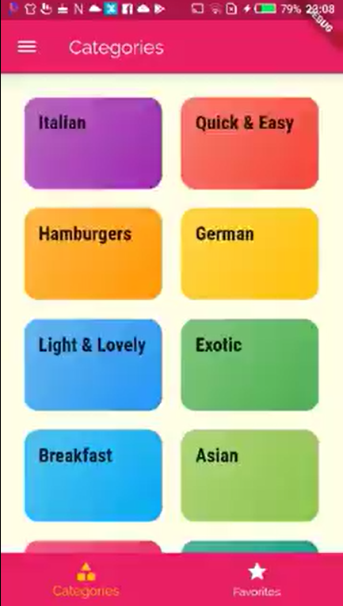

<h1 align="center">Flutter-TheMealApp</h1>
<a href="#">
  <div align="center" >
    
  </div>
</a>

## <h2 align = "center"> [Tap to see the video of this app](https://hirashahid.thecloudsoft.com/flutter-themealapp/)</h2>

## Functionalities
- [x] This app has 3 screens, main screen where user can see the meal categories screen 
- [x] Once the user selects any category, then the relative meals screen comes up, where user can see all the related meals lists 
- [x] If user selects a meal, then another screen pops up and it shows the Ingredients of that selected meal and also the steps to make that meal. 
- [x] Along with that, a user can also like the meal and it would be added to the user’s favourites 
- [x] Also, user can filter the meals such as Gluten-Free Meals, Lactose-Free Meals and so on.

## What I have Learnt so Far:
- [x] Creating a Grid and working with Linear Gradients 
- [x] Navigation 
- [x] Using Named Routes and passing data using them
- [x] onGenerateRoute and onUnknownRoute
- [x] Tab Bar and Bottom Bar
- [x] Drawers 
- [x] Stacks

## How To Run
```
git clone https://github.com/hirashahid/Flutter-TheMealApp
cd Flutter-TheMealApp
flutter run
```

## Author
You can get in touch with me on my LinkedIn Profile:

#### Hira Shahid
[](https://www.linkedin.com/in/thehirashahid)

You can also follow my GitHub Profile to stay updated about my latest projects: [](https://github.com/hirashahid)

If you liked the repo then kindly support it by giving it a star ⭐!

## LICENSE
- MIT (2021)
